# Jason Parkin | Developer (T1A2: Portfolio)

 

## About

Hey there! Welcome to my portfolio website. I'm Jason Parkin, and I'm looking to pursue a career in the world of web development. This site is basically my digital resume, where I showcase all the cool stuff I've learned and created along the way.

But hey, I'm not just passionate about code. I believe there's more to me than just technical skills, you'll also get a peek into what makes me tick outside of the tech world.

 

## Links

- Published Portfolio - [https://www.jasonparkin.online/](https://www.jasonparkin.online/)
- GitHub Repository - [https://github.com/jay-parkin/Portfolio](https://github.com/jay-parkin/Portfolio)

 

## Purpose

As mentioned earlier, the aim of this website is to create a portfolio showcasing my abilities as web developer. It will not only showcase the skills I've acquired through my Coder Academy bootcamp and previous learning experiences but also offer insights into my personal experiences beyond coding.

The anticipated audience for my website includes recruiters and hiring managers seeking candidates for entry-level web development/engineering positions. Whether they are actively searching for potential hires or have come across my application for a specific role, this platform aims to provide them with a comprehensive understanding of my capabilities.

 

## Functionality / Features

The key functionalities and features are as shown below:\
\
<b>Functionalities</b>

- <b>Navigation Menu</b>: Users can navigate through different pages of the portfolio using a nav menu located in the header.
- <b>Toggleable Menu</b>: Users can toggle the visibility of the menu on smaller screens, providing a clean and unobtrusive design.
- <b>Responsive Design</b>: The website is designed to be responsive, using flexbox and @media queries to respond and fit different screen sizes.
- <b>Clickable Social Links</b>: Social media icons in the footer are clickable, allowing users to easily access my social profiles.

\
<b>Features</b>

- <b>Color Scheme</b>: A consistent color scheme throughout the website, contributing to a professional aesthetic.
- <b>Image Display</b>: The image of myself adds a personal touch and helps users connect with me on a more personal level.
- <b>Animated Logo</b>: The spinning animation of the logo adds visual interest and a unique touch to the website.
- <b>Google Fonts Integration</b>: Google Fonts are intergrated to enhance typography, adding visual appeal to my content.

 

## Sitemap

First things first was sitemap, which was designed and used as the primary source of direction when developing the portfolio and pages.

    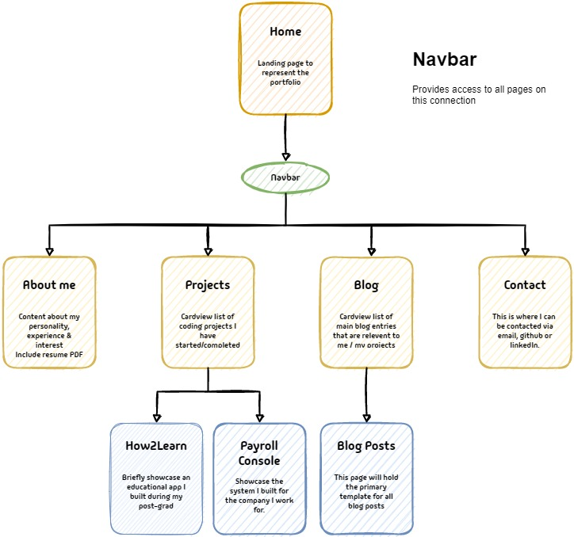

 

## Design

Designing the font and colour palette was the hardest decision and was changed many times through the the project's creation.

### Font - Google

Additional fonts used throughout.

    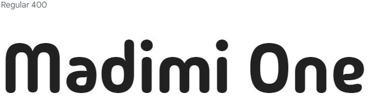
    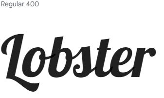

### Icons - Google

Menu icon used for open and closed states.

    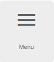
    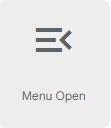

### Colour Palette - Coolors.co

Many colour palettes were chosen, in the end I've gone with Blue.

    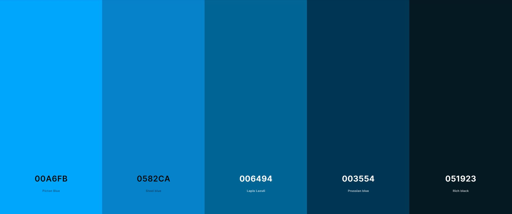

 

## Target Audience

My portfolio was specifically created to showcase my relevent skills for any recruiters/hiring managers.
This is ideally my first step into gaining a role of a web developer and will act as a sneak peak into what I bring to the table for those dev teams looking top notch talent.

The targetted audience is anyone looking for a entry level developer, whether they are actively searching or just so happen to stumble upon my application.

So, my portfolio is all about making their job easier by giving them a crystal clear view of what I'm all about; my skills, my passion for web development, and my hunger for growth in the field.

 

## Tech Stack
The following tools were used in the process of planning and developing.

- <b>GitHub</b>: Version control.
- <b>Draw.io</b>: Flow chart designer used to create the sitemap.
- <b>VS Code</b>: IDE for writing code.
- <b>HTML</b>: Containing the elements and content of the pages.
- <b>CSS</b>: Styles the content displayed.
- <b>Javascript</b>: for interacting with the menu button

 

## Screenshots

### Home

#### Mobile - Wireframe

    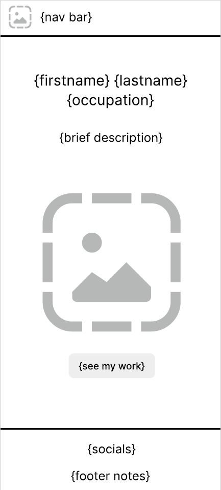

#### Mobile - Deployed

    

#### Desktop - Wireframe

    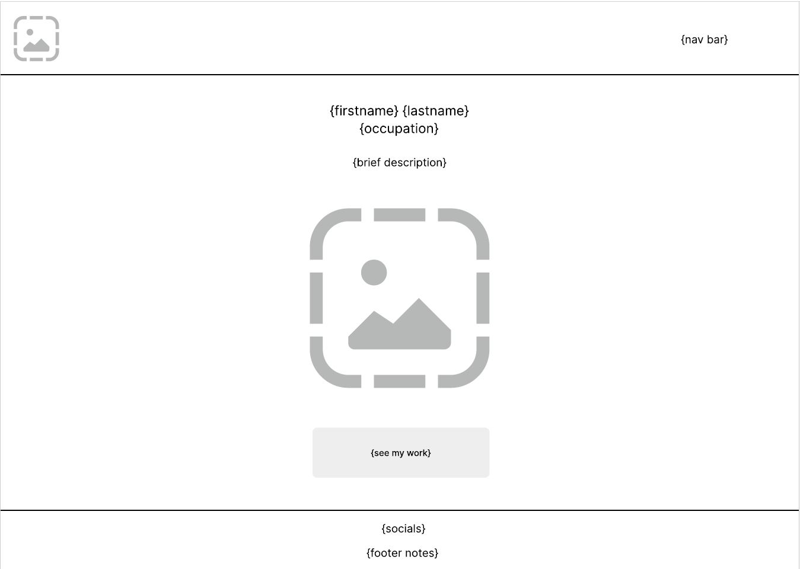

#### Desktop - Deployed

    

 

#

 

### About

#### Mobile - Wireframe

    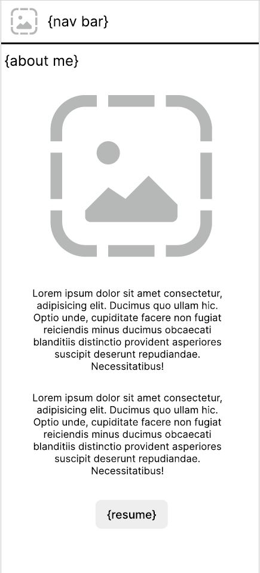
    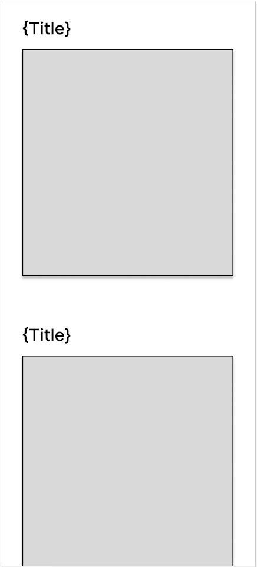

#### Mobile - Deployed

    
    
    
    

#### Desktop - Wireframe

    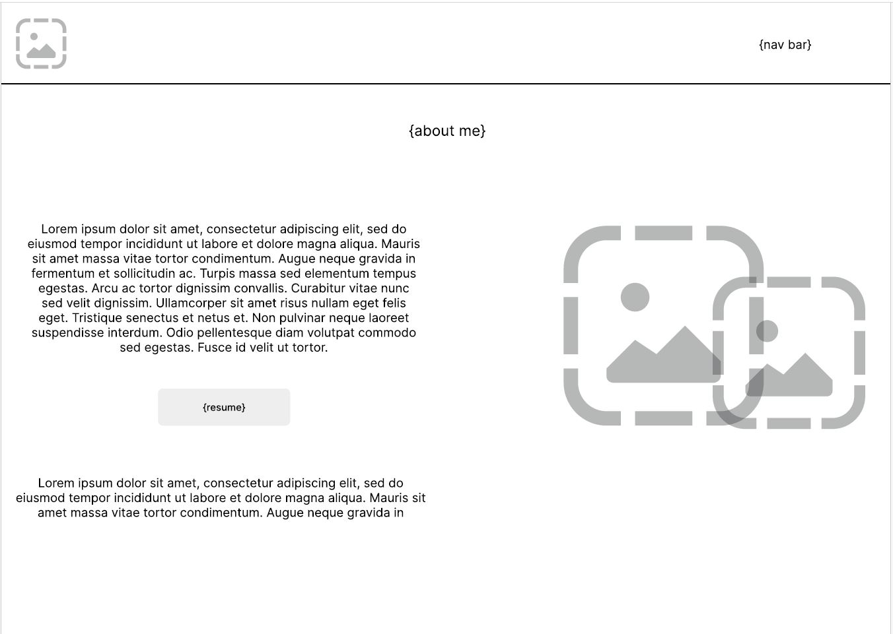
    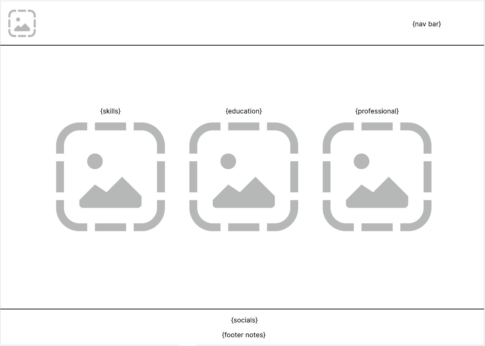

#### Desktop - Deployed

    
    

#

 

### Projects

#### Mobile - Wireframe

    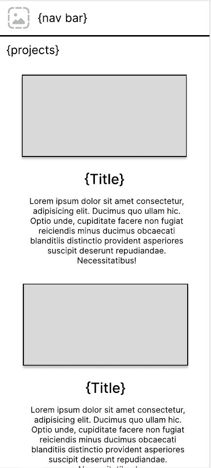
    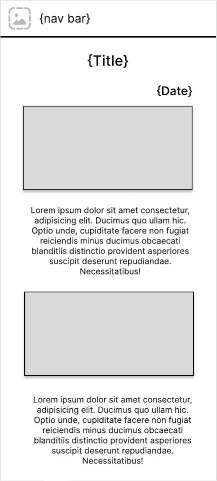

#### Mobile - Deployed

    
    

#### Desktop - Wireframe

    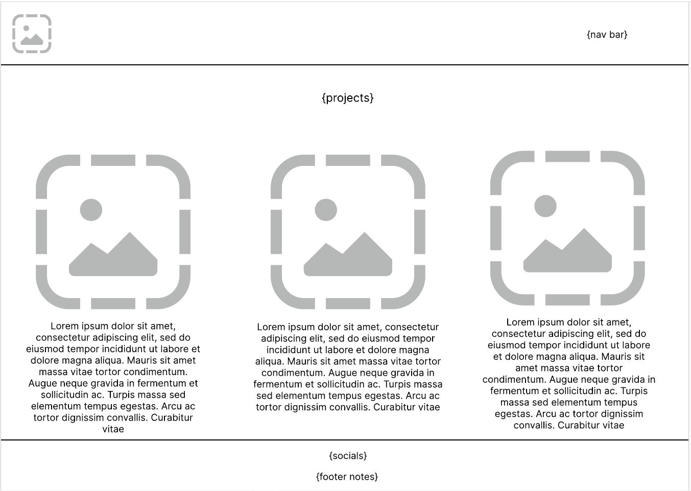

#### Desktop - Deployed

    

 

#

 

### Blog

#### Mobile - Wireframe

    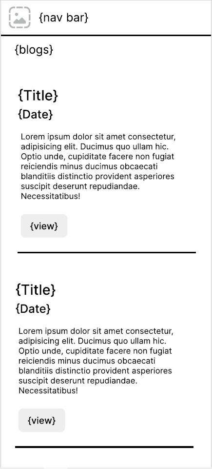

#### Mobile - Deployed

    
    
    
    
    

#### Desktop - Wireframe

    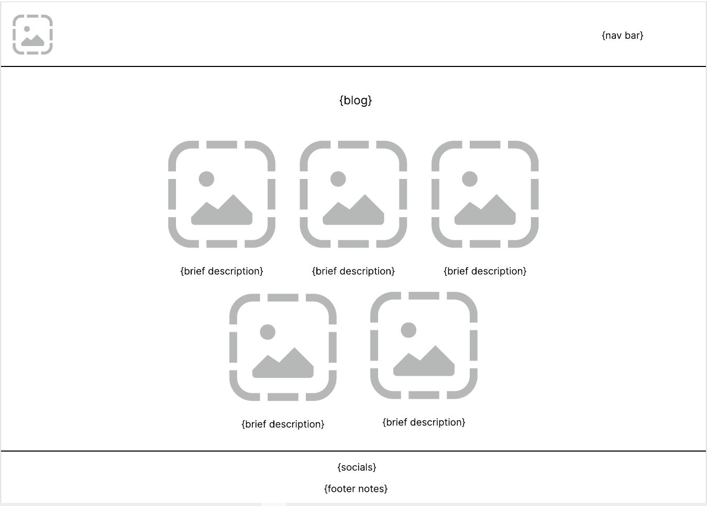

#### Desktop - Deployed

    
    

 

#

 

### Contact

#### Mobile - Wireframe

    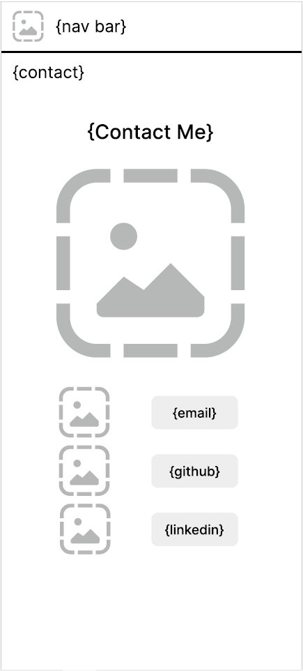

#### Mobile - Deployed

    

#### Desktop - Wireframe

    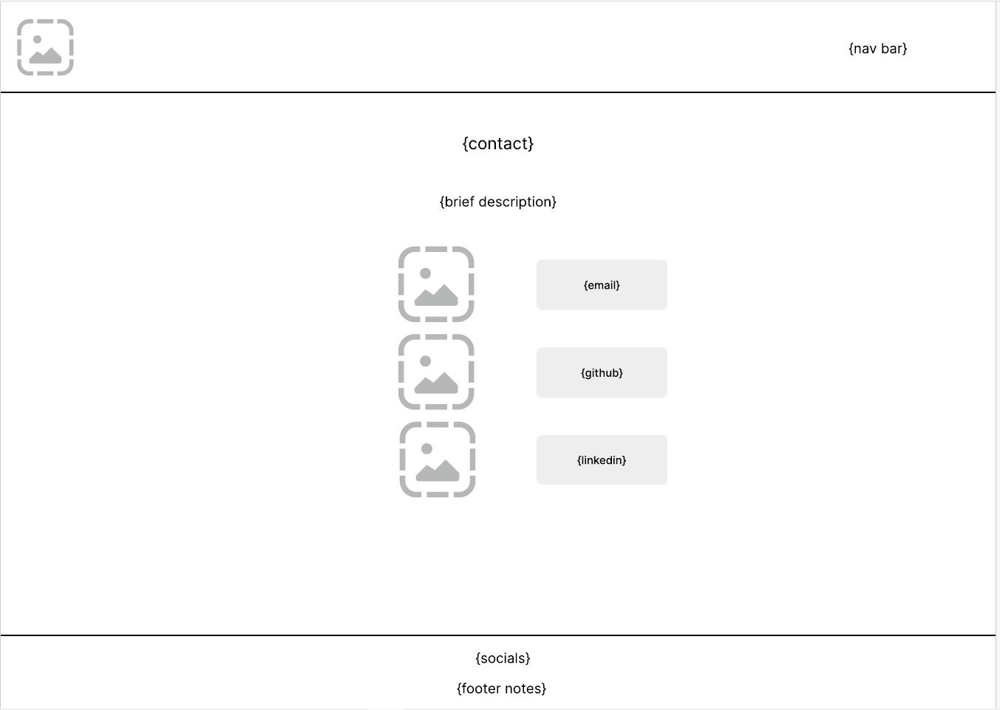

#### Desktop - Deployed

    

#
